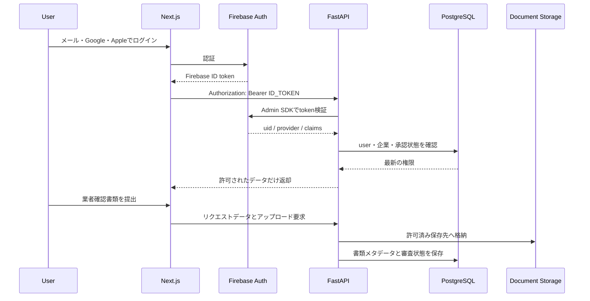

# アカウント認証・業者承認システム設計方針

## 1. 目的

本ドキュメントは、次の機能を実装するための初期設計方針をまとめたものです。

- 一般ユーザーのアカウント作成とログイン
- メールアドレス、Google、Appleによる認証
- 一般ユーザーによる業者権限リクエスト
- システム管理者による業者権限リクエストの審査と承認
- 承認済み業者だけに施工情報の登録・更新を許可
- 審査内容と権限変更の監査記録

PoCでは、ログインできることだけでなく、未承認業者による施工情報の登録をbackendで
確実に拒否できることを最初の完成地点とします。

## 2. 結論

Firebase Authenticationの採用は、このプロジェクトに適しています。ただし、Firebaseに
任せるのは「誰がログインしたか」という本人認証までに限定します。

```text
Firebase Authentication
└── 本人認証
    ├── メールアドレス・パスワード
    ├── Google
    └── Apple

FastAPI + PostgreSQL
└── 業務上の権限と状態
    ├── 一般ユーザー
    ├── 企業への所属
    ├── 業者権限リクエスト
    ├── 業者承認・停止
    ├── システム管理者
    └── 施工情報の操作権限
```

FirebaseのCustom Claimsだけで業者権限リクエストや審査情報を管理してはいけません。
Custom Claimsはトークン更新まで反映に時間差があり、審査理由や履歴を保持する用途にも
適さないためです。審査状態と権限の正本はPostgreSQLに置きます。

Custom Claimsは、`system_admin: true` のような小さく変更頻度の低い権限をUIへ伝える用途に
限定します。FastAPIはFirebase IDトークンを検証したうえで、重要な操作ごとにPostgreSQLの
最新状態も確認します。

## 3. アカウントモデル

すべての利用者は、最初に一般ユーザーとして同じアカウント作成フローを利用します。
業者として利用したいユーザーは、ログイン後に業者権限をリクエストします。承認時に別の
Firebaseアカウントを作成したり、一般ユーザーアカウントを業者専用アカウントへ変換したり
せず、同じユーザーへ企業所属と業者機能の権限を追加します。

そのため、「一般ユーザーアカウント」と「業者アカウント」を別のユーザー種別として固定せず、
ユーザー、企業、企業への所属を分離します。

```text
User
├── Firebase UID
├── 一般ユーザーとしてのプロフィール
└── 0個以上のOrganizationへ所属
        └── 承認済みOrganizationに所属している場合だけ業者機能を利用可能
```

この構成には次の利点があります。

- 全員が一般ユーザーとして開始し、必要な人だけ後から業者権限をリクエストできる
- 承認後も同じアカウントで一般ユーザー向け機能を利用できる
- 1つの企業に複数担当者を所属させられる
- 担当者の退職時に、企業自体を削除せず所属だけ無効化できる
- 同じ人が複数企業へ所属する将来要件にも対応できる
- 施工情報の所有者を個人ではなく企業にできる

個人事業主もOrganizationとして扱い、`organization_type` で法人と個人事業主を区別します。

## 4. ロールと状態

### 4.1 システムロール

| ロール | 説明 |
| --- | --- |
| `user` | Firebaseで認証済みの一般ユーザー |
| `system_admin` | 業者権限リクエスト、停止、再審査を扱うシステム管理者 |

システム管理者は公開画面から登録できないようにします。初期管理者は、管理用スクリプトまたは
Firebase Admin SDKによって対象Firebase UIDを明示的に登録します。

### 4.2 企業内ロール

| ロール | 説明 |
| --- | --- |
| `owner` | 企業情報とメンバーを管理できる責任者 |
| `editor` | 施工情報を登録・更新できる担当者 |
| `viewer` | 企業内情報を参照できる担当者 |

企業内ロールがあっても、企業自体が `approved` でなければ施工情報は登録できません。

### 4.3 業者権限リクエスト状態

| 状態 | 説明 |
| --- | --- |
| `draft` | リクエストしたユーザーが入力中 |
| `submitted` | 提出済み、管理者の確認待ち |
| `under_review` | 管理者が審査中 |
| `changes_requested` | 情報・書類の追加提出待ち |
| `approved` | 承認済み |
| `rejected` | 却下済み |
| `withdrawn` | リクエストしたユーザーが取下げ |

状態変更はFastAPIの管理者APIだけで行い、frontendからDB状態を直接更新させません。
ただし、`draft` から `submitted` への提出と、許可された状態からの `withdrawn` への取下げは、
リクエストした一般ユーザー本人が行えます。

### 4.4 業者としての企業状態

| 状態 | 説明 |
| --- | --- |
| `pending` | 業者権限リクエスト中または未承認 |
| `approved` | 業者として承認済み |
| `suspended` | 承認後に一時停止 |
| `revoked` | 業者承認を取り消し |

`suspended` と `revoked` はリクエスト状態ではなく、承認後の企業に対する状態です。

## 5. 権限マトリクス

| 操作 | 未ログイン | 一般ユーザー | リクエスト中ユーザー | 承認済み業者 | 管理者 |
| --- | ---: | ---: | ---: | ---: | ---: |
| 公開情報の閲覧 | 可 | 可 | 可 | 可 | 可 |
| 自分のプロフィール更新 | 不可 | 可 | 可 | 可 | 可 |
| 業者権限リクエスト | 不可 | 可 | 更新可 | 不要 | 代理操作は原則不可 |
| 施工情報の登録 | 不可 | 不可 | 不可 | 可 | 原則不可 |
| 自社施工情報の更新 | 不可 | 不可 | 不可 | 可 | 原則不可 |
| 業者権限リクエスト一覧の閲覧 | 不可 | 不可 | 不可 | 不可 | 可 |
| 業者権限リクエストの承認・却下 | 不可 | 不可 | 不可 | 不可 | 可 |
| 業者の停止・取消 | 不可 | 不可 | 不可 | 不可 | 可 |
| 監査ログの閲覧 | 不可 | 不可 | 不可 | 不可 | 可 |

施工情報の登録・更新では、次の条件をすべてbackendで確認します。

1. Firebase IDトークンが有効である
2. Firebase UIDに対応するユーザーが有効である
3. 対象企業のメンバーである
4. 企業の業者状態が `approved` である
5. 企業内ロールが `owner` または `editor` である
6. 更新対象の施工情報が同じ企業に属している

frontendでボタンを隠すだけでは権限制御になりません。すべての更新APIでFastAPIが条件を
再確認します。

## 6. システム構成



### 6.1 frontendの責務

- Firebase JavaScript SDKによるログイン
- IDトークンの取得とFastAPIへの送信
- ログイン状態に応じた画面切り替え
- 一般ユーザー向けの業者権限リクエストフォーム
- 自分の業者権限リクエスト状況画面
- 管理者用のリクエスト一覧・詳細・審査画面
- 401、403、追加提出要求の表示

IDトークンを独自実装でlocalStorageへ複製せず、Firebase SDKのセッション管理を利用します。

### 6.2 backendの責務

- Firebase Admin SDKによるIDトークン検証
- Firebase UIDとローカルユーザーの対応付け
- ユーザー・企業・所属・リクエスト状態の管理
- 業者権限と企業内ロールの判定
- 管理者権限の判定
- 審査結果、根拠、操作履歴の保存
- 施工情報APIの認可

FirebaseのIDトークンはfrontendからHTTPSでFastAPIへ送信し、FastAPI側で検証してUIDを
取得します。frontendから送られた `role`、`organization_id`、`is_admin` は信用しません。

### 6.3 書類ストレージの責務

審査書類のバイナリはPostgreSQLへ直接保存せず、Cloud Storage for Firebaseまたは
Google Cloud Storageへ保存します。PostgreSQLには保存先、ファイル種別、ハッシュ、
提出者、提出日時、審査結果を保存します。

ファイルは非公開を初期値とし、リクエストしたユーザー本人と担当管理者だけが期限付きURLなどで参照できる
ようにします。

## 7. 一般ユーザーの認証フロー

### 7.1 メールアドレス・パスワード

1. ユーザーがメールアドレスとパスワードを入力
2. Firebase Authenticationでアカウント作成
3. 確認メールを送信
4. メール確認後、FastAPIの `/auth/sync` を呼び出す
5. PostgreSQLへユーザー行を作成

メール未確認のユーザーには、業者権限リクエストや重要情報の変更を許可しません。

### 7.2 Google

FirebaseのGoogle Providerを使用します。初回ログイン時にFastAPIでユーザー行を作成し、
2回目以降はFirebase UIDで同じユーザーを取得します。

### 7.3 Apple

FirebaseのApple Providerを使用します。Apple Developer Program、Services ID、秘密鍵、
認証ドメインなどの準備が必要です。

Appleはユーザーがメールを非公開にした場合、`privaterelay.appleid.com` のアドレスを返す
ことがあります。また、表示名などは初回ログイン時にしか取得できない場合があります。
メールアドレスをユーザーの一意キーにせず、Firebase UIDを使用します。

Firebaseから確認メールなどを送る場合は、AppleのPrivate Email Relay設定も行います。

### 7.4 アカウントの重複防止

同じ人がメール、Google、Appleで別々のFirebaseユーザーにならないよう、ログイン済みの
ユーザーが認証プロバイダーを追加できる「アカウント連携」を後続機能として用意します。

メールアドレスだけを根拠に自動統合してはいけません。特にAppleの匿名メールを他の個人情報へ
関連付ける場合は、ユーザー同意とAppleの要件を確認します。

## 8. 業者権限リクエストフロー

```text
一般ユーザーとしてログイン
        ↓
一般ユーザー画面で「業者として利用する」を選択
        ↓
企業または個人事業主を登録
        ↓
企業との関係を示す情報・確認書類を提出
        ↓
submitted
        ↓
管理者が審査を開始
        ↓
under_review
   ├── changes_requested → 再提出
   ├── rejected
   └── approved
        ↓
対象企業を承認済みに変更
        ↓
リクエストしたユーザーを企業のownerとして有効化
        ↓
施工情報の登録が可能
```

リクエスト中もユーザーの基本ロールは `user` のままです。承認時には、同じDBトランザクションで
対象企業の `contractor_status` を `approved` に変更し、リクエストしたユーザーの
`organization_members.role` を `owner`、`status` を `active` にします。新しいFirebase
アカウントは作成しません。

業者権限リクエスト時の主な入力候補は次のとおりです。

- 法人名または屋号
- 法人番号（法人の場合）
- 所在地
- 代表者名
- 電話番号
- 公式Webサイト
- 店舗・事業所情報
- 建設業許可番号と許可行政庁
- 担当者名、部署、企業との関係
- 業務用メールアドレス
- 取引実績を確認するための情報
- 必要な確認書類
- 個人情報と審査情報の利用目的への同意

提出後の内容は直接上書きせず、再提出履歴またはリクエストバージョンを残します。

同じ企業へ2人目以降のユーザーを追加する場合は、企業自体の業者審査を繰り返さず、
「承認済み企業への参加リクエスト」として別フローにします。企業の `owner` または管理者が
所属を確認し、必要な企業内ロールを付与します。

## 9. 管理者による業者権限リクエスト審査

### 9.1 審査原則

PoCでは自動承認を行わず、システムが確認材料を集約し、最終判断はシステム管理者が行います。

「検索結果がなかった」ことは「問題が存在しない」ことの証明にはなりません。公的サイトごとに
掲載範囲、更新頻度、対象期間が異なるため、確認日時、検索条件、参照先、判断理由を記録します。

### 9.2 審査チェックリスト

| 確認項目 | 確認方法の例 | 保存する証跡 |
| --- | --- | --- |
| 法人の存在 | 国税庁法人番号公表サイト | 法人番号、名称、所在地、確認日時、URL |
| 許可・登録 | 国土交通省の企業情報検索 | 許可番号、許可業種、有効性、確認日時 |
| 店舗・事業所 | 公式サイト、電話確認、提出書類、必要に応じ現地確認 | 確認方法、担当者、日時、結果 |
| 営業状態 | 電話・メール、公式情報、許可情報 | 連絡結果、確認日時 |
| リクエストしたユーザーと企業の関係 | 業務用メール、委任状、在籍確認等 | 書類種別、確認結果 |
| 取引実績 | 契約書・請求書等の必要部分 | 書類種別、対象期間、確認結果 |
| 行政処分等 | 国土交通省ネガティブ情報等検索サイト等 | 検索条件、対象期間、結果、URL |
| 総合判断 | 上記結果と社内基準 | 承認・却下理由、審査担当者、日時 |

国税庁法人番号公表サイトで確認できるのは、主に名称、所在地、法人番号です。営業実態や
信頼性を直接保証するものではありません。

国土交通省ネガティブ情報等検索サイトの建設業者情報は最近5年分の行政処分等が中心です。
検索結果だけで無期限・全分野の処分歴がないと判断しないようにします。必要に応じて許可行政庁、
地方公共団体、他分野の監督官庁が公開する情報も確認します。

### 9.3 承認操作

管理者が承認・却下するときは、次の情報を必須にします。

- 判断結果
- 判断理由
- チェックリストの完了状況
- 審査担当者のFirebase UIDとローカルユーザーID
- 審査日時
- 参照した資料と確認日時
- 追加条件または有効期限

承認APIは、更新前状態と更新後状態を同じDBトランザクションで監査ログへ保存します。

### 9.4 承認後の再審査

承認を永続的な保証として扱わず、次の契機で `suspended` または再審査へ移行できるようにします。

- 許可の失効または更新未確認
- 企業情報の大幅な変更
- 行政処分情報の確認
- 利用規約違反や虚偽のリクエスト内容の疑い
- 一定期間ごとの定期確認

## 10. 管理者アカウント

システム管理者には一般ユーザーより強い保護が必要です。

- 公開サインアップから管理者を作成しない
- 管理者Firebase UIDを手動で許可リストへ追加
- productionではFirebase Authentication with Identity PlatformのMFAを必須にする
- 管理画面と管理APIの両方で権限を確認
- 管理操作をすべて監査ログへ記録
- 自分自身の管理者権限変更を禁止または別管理者の確認対象にする
- 最低2名の管理者を用意し、緊急時の復旧手順を定める
- Firebase Admin SDKのサービスアカウント鍵をGitへ保存しない

PoCでは1名承認から開始できますが、本番運用では高リスクな承認・取消について二者承認も
検討します。

## 11. データモデル案

### 11.1 `users`

| カラム | 用途 |
| --- | --- |
| `id` | 内部UUID |
| `firebase_uid` | Firebase UID、一意 |
| `email` | 連絡用メール。識別子としては使わない |
| `display_name` | 表示名 |
| `email_verified` | Firebaseとの同期値 |
| `system_role` | `user` または `system_admin`。公開APIから変更不可 |
| `status` | `active`、`suspended`、`deleted` |
| `created_at` / `updated_at` | 作成・更新日時 |

### 11.2 `organizations`

| カラム | 用途 |
| --- | --- |
| `id` | 企業UUID |
| `organization_type` | `corporation` または `sole_proprietor` |
| `name` | 法人名または屋号 |
| `corporate_number` | 法人番号、法人の場合は一意 |
| `representative_name` | 代表者名 |
| `address` | 所在地 |
| `phone_number` | 事業所の連絡先 |
| `website_url` | 公式サイト、存在しない場合はNULL |
| `permit_number` | 建設業許可番号 |
| `contractor_status` | `pending`、`approved`、`suspended`、`revoked` |
| `approved_at` | 承認日時 |

### 11.3 `organization_members`

| カラム | 用途 |
| --- | --- |
| `organization_id` | 企業ID |
| `user_id` | ユーザーID |
| `role` | `owner`、`editor`、`viewer` |
| `status` | `invited`、`active`、`disabled` |

### 11.4 `contractor_access_requests`

| カラム | 用途 |
| --- | --- |
| `id` | 業者権限リクエストUUID |
| `organization_id` | 対象企業 |
| `requested_by` | リクエストした一般ユーザー |
| `applicant_department` | 申請者の部署、該当しない場合はNULL |
| `applicant_job_title` | 申請者の役職、該当しない場合はNULL |
| `business_email` | 審査連絡用メール |
| `relationship_to_organization` | 申請者と企業の関係 |
| `declaration_accepted_at` | 申告事項への同意日時 |
| `status` | リクエスト状態 |
| `version` | 再提出と同時更新検知に使用するバージョン |
| `submitted_at` | 提出日時 |
| `reviewed_by` | 最終審査担当者 |
| `reviewed_at` | 最終審査日時 |
| `decision_reason` | 判断理由 |

### 11.5 `contractor_request_checks`

| カラム | 用途 |
| --- | --- |
| `request_id` | 業者権限リクエストID |
| `check_type` | 法人、許可、営業、取引、処分歴等 |
| `result` | `pass`、`fail`、`unknown`、`not_applicable` |
| `source_url` | 参照先 |
| `checked_at` | 確認日時 |
| `checked_by` | 確認者 |
| `notes` | 判断メモ |

### 11.6 `contractor_request_documents`

| カラム | 用途 |
| --- | --- |
| `request_id` | 業者権限リクエストID |
| `document_type` | 書類種別 |
| `storage_path` | 非公開ストレージの保存先 |
| `sha256` | 改ざん・重複確認用ハッシュ |
| `uploaded_by` | 提出者 |
| `uploaded_at` | 提出日時 |
| `retention_until` | 保存期限 |

### 11.7 `audit_logs`

| カラム | 用途 |
| --- | --- |
| `actor_user_id` | 操作者 |
| `action` | `approve_contractor_access`、`reject_contractor_access` 等 |
| `target_type` / `target_id` | 操作対象 |
| `before_data` / `after_data` | 変更前後の必要項目 |
| `reason` | 操作理由 |
| `created_at` | 操作日時 |

監査ログは通常の管理画面から更新・削除できないようにします。保存する個人情報は必要最小限に
し、パスワードやFirebase IDトークンを保存してはいけません。

## 12. API案

### 12.1 認証・ユーザー

| Method | Path | 権限 | 用途 |
| --- | --- | --- | --- |
| POST | `/auth/sync` | Firebase認証済み | FirebaseユーザーをDBへ同期 |
| GET | `/me` | Firebase認証済み | 自分のプロフィールと権限を取得 |
| PATCH | `/me` | Firebase認証済み | 自分のプロフィールを更新 |

### 12.2 業者権限リクエスト

| Method | Path | 権限 | 用途 |
| --- | --- | --- | --- |
| POST | `/contractor-access-requests` | 一般ユーザー | リクエストの下書き作成 |
| GET | `/contractor-access-requests/me` | 一般ユーザー | 自分のリクエストを取得 |
| PATCH | `/contractor-access-requests/{id}` | リクエストしたユーザー | 下書き・追加提出を更新 |
| POST | `/contractor-access-requests/{id}/submit` | リクエストしたユーザー | リクエストを提出 |
| POST | `/contractor-access-requests/{id}/withdraw` | リクエストしたユーザー | リクエストを取下げ |

### 12.3 管理者

| Method | Path | 権限 | 用途 |
| --- | --- | --- | --- |
| GET | `/admin/contractor-access-requests` | 管理者 | リクエスト一覧 |
| GET | `/admin/contractor-access-requests/{id}` | 管理者 | リクエスト詳細と証跡 |
| POST | `/admin/contractor-access-requests/{id}/start-review` | 管理者 | 審査開始 |
| PUT | `/admin/contractor-access-requests/{id}/checks/{check_type}` | 管理者 | チェック結果を保存 |
| POST | `/admin/contractor-access-requests/{id}/request-changes` | 管理者 | 追加提出要求 |
| POST | `/admin/contractor-access-requests/{id}/approve` | 管理者 | 業者権限を承認 |
| POST | `/admin/contractor-access-requests/{id}/reject` | 管理者 | リクエストを却下 |
| POST | `/admin/organizations/{id}/suspend` | 管理者 | 業者停止 |
| POST | `/admin/organizations/{id}/revoke` | 管理者 | 承認取消 |

### 12.4 施工情報

| Method | Path | 権限 | 用途 |
| --- | --- | --- | --- |
| POST | `/organizations/{id}/construction-records` | 承認済みowner/editor | 施工情報登録 |
| PATCH | `/organizations/{id}/construction-records/{record_id}` | 同じ企業のowner/editor | 施工情報更新 |
| DELETE | `/organizations/{id}/construction-records/{record_id}` | 同じ企業のowner | 施工情報削除 |

## 13. FastAPIの認可部品案

認証と認可を各APIへ直接書かず、依存関係として分離します。

```python
async def get_current_identity() -> FirebaseIdentity:
    """Bearer tokenを検証し、Firebase UIDを返す。"""


async def get_current_user() -> User:
    """Firebase UIDに対応する有効なDBユーザーを返す。"""


async def require_system_admin() -> User:
    """最新の管理者権限を確認する。"""


async def require_approved_contractor(
    organization_id: UUID,
) -> OrganizationMembership:
    """企業承認状態と企業内ロールを確認する。"""
```

認証失敗は401、ログイン済みだが権限がない場合は403、他社所有データを隠す必要がある場合は
404を返す方針をAPI単位で定めます。

## 14. セキュリティと個人情報

- すべての認証済み通信でHTTPSを使用する
- 認可はfrontendではなくFastAPIで強制する
- Firebase Admin SDKの認証情報をSecret Manager等で管理する
- 開発、staging、productionでFirebaseプロジェクトとDBを分離する
- 管理者はMFA必須とする
- 審査書類は非公開、暗号化、アクセス期限付きとする
- ファイル形式、容量、MIME typeを制限する
- 審査画面の閲覧とダウンロードも監査対象にする
- ログへIDトークン、パスワード、書類本文を出力しない
- リクエストAPI、ログイン関連APIへレート制限を設ける
- 退会、リクエスト取下げ、却下後の保存期間と削除手順を定める
- プライバシーポリシーと利用目的をリクエスト提出前に提示する

審査書類には個人情報や取引情報が含まれる可能性があります。取得項目、利用目的、保存期間、
閲覧者、削除方法を実装前に決め、個人情報保護委員会のガイドラインを踏まえた安全管理措置を
講じます。本ドキュメントは法的助言ではないため、本番運用前に法務・個人情報保護の確認が
必要です。

## 15. 実装フェーズ

### Phase 1: 一般ユーザー認証

- Firebaseプロジェクトを開発環境用に作成
- メール・パスワード認証
- Google認証
- メール確認
- Next.jsの認証状態管理
- FastAPIのIDトークン検証
- `users` テーブルと `/auth/sync`、`/me`

### Phase 2: 企業と業者権限リクエスト

- `organizations` と `organization_members`
- `contractor_access_requests`
- 業者権限リクエストの下書き、提出、追加提出
- 非公開書類アップロード
- リクエストしたユーザー向けステータス画面

### Phase 3: 管理者による業者権限リクエスト審査

- 管理者の手動登録
- 管理者MFA
- リクエスト一覧と詳細
- 審査チェックリスト
- 追加提出要求、承認、却下
- 監査ログ

### Phase 4: 施工情報の認可

- 施工情報へ `organization_id` を付与
- 承認済み企業だけ登録可能にする
- 企業内ロールによる更新・削除制御
- 401、403、他社データ操作の自動テスト

### Phase 5: Apple認証と運用強化

- Apple Developer Programの設定
- Apple認証
- Private Email Relay
- アカウント連携
- 業者の定期再審査と停止
- 管理者二者承認の検討

Apple認証は外部設定が多いため、メール・Googleとbackend認証基盤を先に完成させ、その後に
追加する順序を推奨します。

## 16. Issue分割案

Issue番号はリポジトリごとに独立しているため、親Issueから各子Issueへのリンクを記載します。

### 親リポジトリ

- `feature: アカウント認証・業者承認機能の統合`
- Firebase環境、frontend/backendの組み合わせ、統合確認を管理
- frontend Issueとbackend Issueを関連Issueとして記載

### backendリポジトリ

1. `feature: Firebase IDトークン検証を追加`
2. `feature: users・organizations・membershipsを追加`
3. `feature: 業者権限リクエストAPIを追加`
4. `feature: 管理者による業者権限リクエスト審査APIを追加`
5. `feature: 監査ログを追加`
6. `feature: 施工情報APIへ業者認可を追加`
7. `test: 認証・認可・業者承認のテストを追加`

### frontendリポジトリ

1. `feature: Firebase認証基盤を追加`
2. `feature: メール・Googleログイン画面を追加`
3. `feature: 一般ユーザー向け業者権限リクエスト画面を追加`
4. `feature: 業者権限リクエスト状況画面を追加`
5. `feature: 管理者用の業者権限リクエスト審査画面を追加`
6. `feature: ロールに応じた画面・操作制御を追加`
7. `feature: Appleログインを追加`

## 17. 実装前に決めること

- 個人事業主を業者承認の対象にするか
- 1企業に複数ユーザーを所属させるか
- 企業メンバーを誰が招待・削除できるか
- 建設業許可が不要な業務をどう審査するか
- 必須書類と保存期間
- 取引実績として何を確認し、どこまで保存するか
- 却下理由をリクエストしたユーザーへどこまで開示するか
- 再リクエストと異議申立てのルール
- 承認の有効期限と再審査間隔
- システム管理者の人数と二者承認の要否
- 一般ユーザーへ公開する業者情報の範囲

## 18. 参考資料

### Firebase

- [Firebase Authentication](https://firebase.google.com/docs/auth)
- [Firebase IDトークンをbackendで検証する](https://firebase.google.com/docs/auth/admin/verify-id-tokens)
- [Custom Claimsによるアクセス制御](https://firebase.google.com/docs/auth/admin/custom-claims)
- [Googleログイン](https://firebase.google.com/docs/auth/web/google-signin)
- [Appleログイン](https://firebase.google.com/docs/auth/web/apple)
- [WebアプリのMFA](https://firebase.google.com/docs/auth/web/multi-factor)
- [TOTP MFA](https://firebase.google.com/docs/auth/web/totp-mfa)

### 業者確認

- [国税庁法人番号公表サイト](https://www.houjin-bangou.nta.go.jp/)
- [国土交通省 建設業者・宅建業者等企業情報検索システム](https://www.mlit.go.jp/totikensangyo/const/sosei_const_tk3_000037.html)
- [国土交通省 ネガティブ情報等検索サイト](https://www.mlit.go.jp/nega-inf/)
- [Gビズインフォ](https://info.gbiz.go.jp/)

### 個人情報

- [個人情報保護委員会 個人情報保護法ガイドライン（通則編）](https://www.ppc.go.jp/personalinfo/legal/guidelines_tsusoku/)
